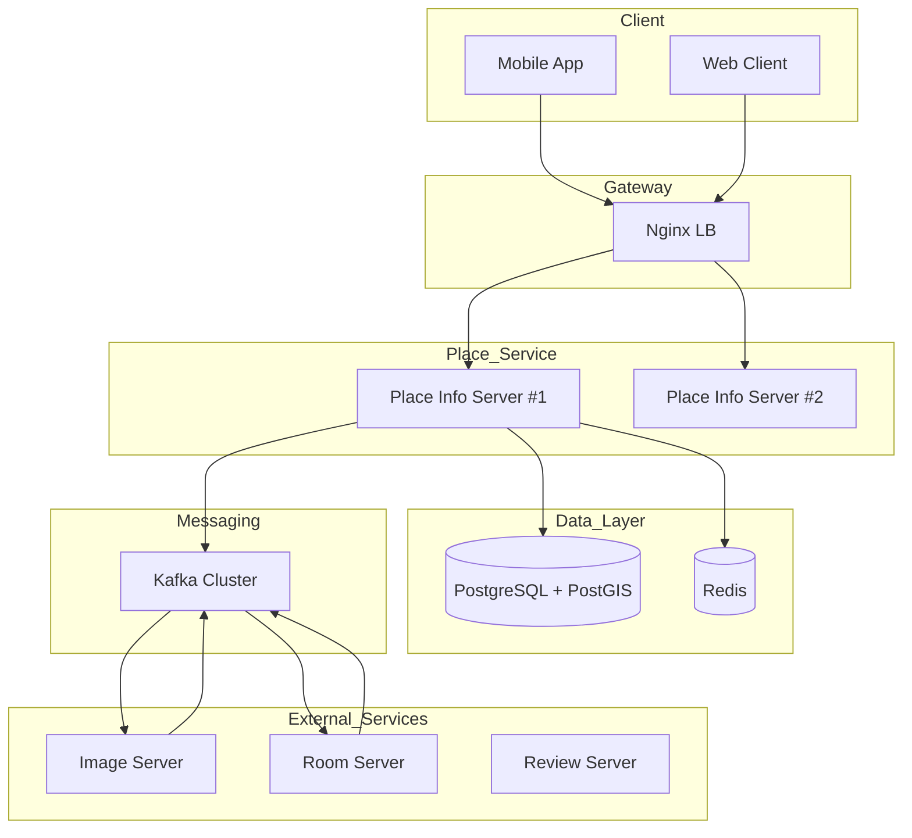
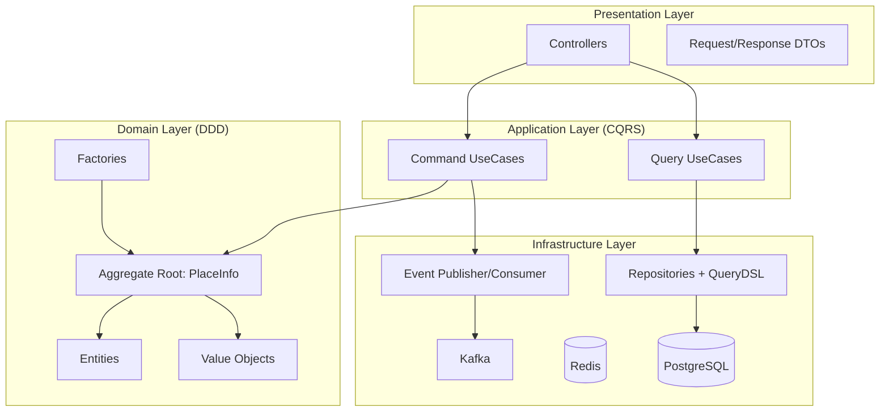
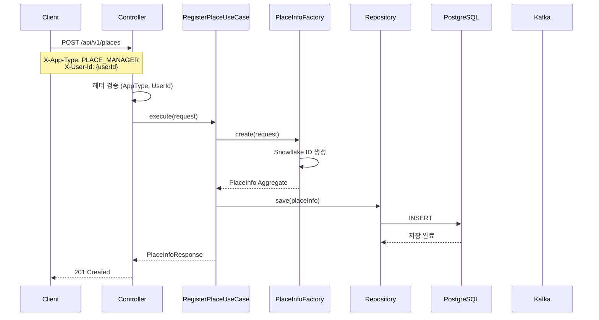
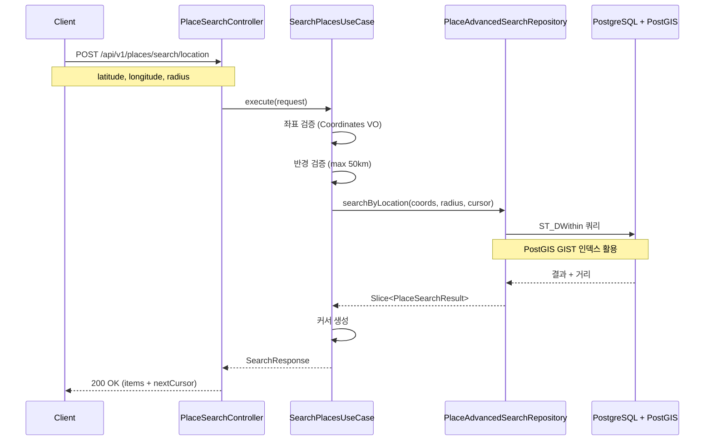
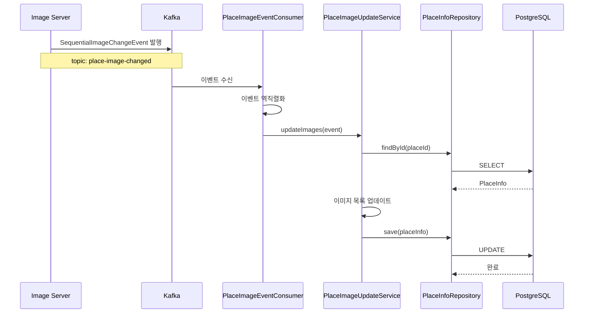
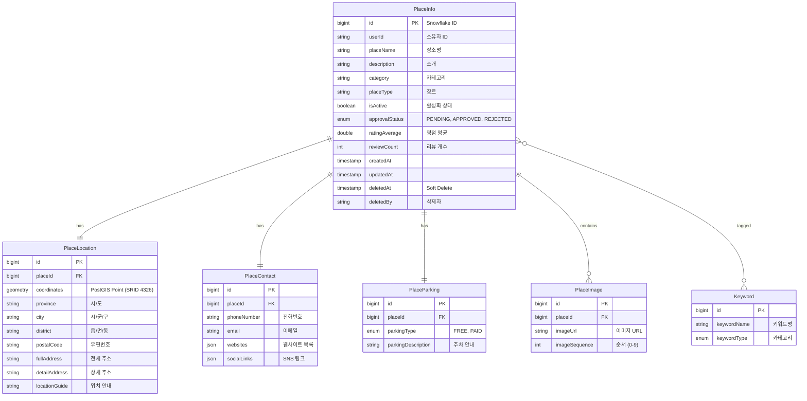
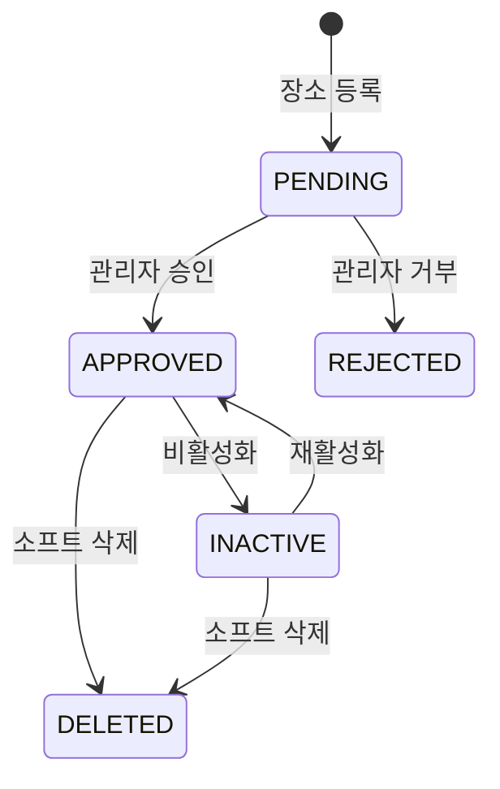

# Place Info Server 가이드 문서

## 1. 개요

### 1.1 목적

Place Info Server는 플랫폼 내 장소(Place) 정보의 등록, 검색, 관리를 담당하는 마이크로서비스이다. 음악 연습실, 공연장, 스튜디오 등 다양한 장소 정보를 통합 관리한다.

### 1.2 주요 기능

| 기능        | 설명                                 |
|-----------|------------------------------------|
| 장소 등록     | 장소 기본 정보, 위치, 연락처, 주차 정보 등록        |
| 위치 기반 검색  | PostGIS 기반 반경 검색 (최대 50km)         |
| 통합 검색     | 키워드, 카테고리, 지역, 키워드 태그 복합 검색        |
| 승인 워크플로우  | PENDING -> APPROVED/REJECTED 상태 관리 |
| 소프트 삭제    | 논리적 삭제 및 데이터 보존                    |
| 이미지 동기화   | Kafka 기반 이미지 서버 연동                 |
| 커서 기반 페이징 | 무한 스크롤 지원 (Slice)                  |

### 1.3 기술 스택

| 구분             | 기술                                      |
|----------------|-----------------------------------------|
| Framework      | Spring Boot 3.5.7                       |
| Language       | Java 21 (Eclipse Temurin)               |
| Database       | PostgreSQL 16.x + PostGIS 3.4           |
| Cache          | Redis 7.x                               |
| Message Broker | Apache Kafka                            |
| Query          | QueryDSL 5.0.0, Hibernate Spatial 6.5.2 |
| Documentation  | Swagger/OpenAPI 3.0                     |

---

## 2. 시스템 아키텍처

### 2.1 전체 구조



### 2.2 레이어 아키텍처



### 2.3 장소 등록 흐름



### 2.4 위치 기반 검색 흐름



### 2.5 이미지 동기화 흐름



---

## 3. 데이터 모델

### 3.1 ERD



### 3.2 테이블 상세

#### place_info (장소 정보)

| 필드              | 타입           | 필수 | 설명                   |
|-----------------|--------------|----|----------------------|
| id              | BIGINT       | Y  | Snowflake ID (PK)    |
| user_id         | VARCHAR(100) | Y  | 소유자 ID (외부 Auth 서비스) |
| place_name      | VARCHAR(100) | Y  | 장소명                  |
| description     | VARCHAR(500) | N  | 소개                   |
| category        | VARCHAR(50)  | N  | 카테고리                 |
| place_type      | VARCHAR(50)  | N  | 장르                   |
| is_active       | BOOLEAN      | Y  | 활성화 상태 (기본: true)    |
| approval_status | VARCHAR(20)  | Y  | 승인 상태 (기본: PENDING)  |
| rating_average  | DOUBLE       | N  | 평점 평균                |
| review_count    | INT          | N  | 리뷰 개수 (기본: 0)        |
| created_at      | TIMESTAMP(6) | Y  | 생성 시각 (JPA Auditing) |
| updated_at      | TIMESTAMP(6) | Y  | 수정 시각 (JPA Auditing) |
| deleted_at      | TIMESTAMP(6) | N  | 삭제 시각 (Soft Delete)  |
| deleted_by      | VARCHAR(100) | N  | 삭제자 ID               |

#### place_location (위치 정보)

| 필드             | 타입                    | 필수 | 설명                        |
|----------------|-----------------------|----|---------------------------|
| id             | BIGINT                | Y  | Auto Increment (PK)       |
| place_id       | BIGINT                | Y  | FK to place_info (UNIQUE) |
| coordinates    | GEOMETRY(Point, 4326) | Y  | PostGIS 좌표 (WGS84)        |
| province       | VARCHAR(50)           | N  | 시/도                       |
| city           | VARCHAR(50)           | N  | 시/군/구                     |
| district       | VARCHAR(50)           | N  | 읍/면/동                     |
| postal_code    | VARCHAR(10)           | N  | 우편번호                      |
| full_address   | VARCHAR(200)          | N  | 전체 주소                     |
| detail_address | VARCHAR(200)          | N  | 상세 주소                     |
| location_guide | VARCHAR(500)          | N  | 위치 안내                     |

#### place_contact (연락처 정보)

| 필드           | 타입           | 필수 | 설명                        |
|--------------|--------------|----|---------------------------|
| id           | BIGINT       | Y  | Auto Increment (PK)       |
| place_id     | BIGINT       | Y  | FK to place_info (UNIQUE) |
| phone_number | VARCHAR(20)  | N  | 전화번호                      |
| email        | VARCHAR(100) | N  | 이메일                       |
| websites     | JSONB        | N  | 웹사이트 목록                   |
| social_links | JSONB        | N  | SNS 링크                    |

#### place_parking (주차 정보)

| 필드                  | 타입           | 필수 | 설명                        |
|---------------------|--------------|----|---------------------------|
| id                  | BIGINT       | Y  | Auto Increment (PK)       |
| place_id            | BIGINT       | Y  | FK to place_info (UNIQUE) |
| parking_type        | VARCHAR(20)  | N  | FREE, PAID                |
| parking_description | VARCHAR(500) | N  | 주차 안내                     |

#### place_image (이미지 정보)

| 필드             | 타입           | 필수 | 설명                  |
|----------------|--------------|----|---------------------|
| id             | BIGINT       | Y  | Auto Increment (PK) |
| place_id       | BIGINT       | Y  | FK to place_info    |
| image_url      | VARCHAR(500) | Y  | 이미지 URL             |
| image_sequence | INT          | Y  | 순서 (0-9)            |

#### keyword (키워드 마스터)

| 필드           | 타입          | 필수 | 설명                  |
|--------------|-------------|----|---------------------|
| id           | BIGINT      | Y  | Auto Increment (PK) |
| keyword_name | VARCHAR(50) | Y  | 키워드명 (UNIQUE)       |
| keyword_type | VARCHAR(30) | Y  | 카테고리                |

**키워드 초기 데이터:**

| Type                         | Keywords                  |
|------------------------------|---------------------------|
| SPACE_TYPE (공간 유형)           | 연습실, 합주실, 레슨실, 녹음실, 스튜디오  |
| INSTRUMENT_EQUIPMENT (악기/장비) | 피아노, 드럼, 기타앰프, 베이스앰프, 마이크 |
| AMENITY (편의시설)               | 주차, 화장실, 냉난방, 방음, 휴게공간    |
| OTHER_FEATURE (기타 특성)        | 저렴, 프라이빗, 교통편리, 24시간      |

---

## 4. API 명세

### 4.1 장소 등록

#### POST /api/v1/places

**장소 등록**

**Headers**

| 헤더         | 필수 | 설명                 |
|------------|----|--------------------|
| X-App-Type | Y  | PLACE_MANAGER (필수) |
| X-User-Id  | Y  | 요청자 사용자 ID         |

**Request**

```json
{
  "placeName": "음악 연습실 A",
  "description": "프로 장비를 갖춘 음악 연습실입니다.",
  "category": "연습실",
  "placeType": "음악",
  "location": {
    "from": "KAKAO",
    "addressData": {
      ...
    },
    "latitude": 37.5665,
    "longitude": 126.9780,
    "locationGuide": "3층 엘리베이터 앞"
  },
  "contact": {
    "phoneNumber": "02-1234-5678",
    "email": "contact@example.com",
    "websites": [
      "https://example.com"
    ],
    "socialLinks": {
      "instagram": "https://instagram.com/example"
    }
  },
  "parking": {
    "parkingType": "PAID",
    "parkingDescription": "시간당 3000원"
  },
  "keywordIds": [
    1,
    2,
    3
  ]
}
```

**Response**

```json
{
  "id": "1234567890123456789",
  "userId": "user123",
  "placeName": "음악 연습실 A",
  "description": "프로 장비를 갖춘 음악 연습실입니다.",
  "category": "연습실",
  "placeType": "음악",
  "isActive": true,
  "approvalStatus": "PENDING",
  "location": {
    ...
  },
  "contact": {
    ...
  },
  "parking": {
    ...
  },
  "keywords": [
    ...
  ],
  "createdAt": "2025-01-15T10:00:00Z"
}
```

**상태 코드**

| 코드  | 설명                            |
|-----|-------------------------------|
| 201 | 등록 성공                         |
| 400 | 잘못된 요청 형식                     |
| 403 | X-App-Type이 PLACE_MANAGER가 아님 |

### 4.2 장소 상세 조회

#### GET /api/v1/places/{placeId}

**Response**

```json
{
  "id": "1234567890123456789",
  "userId": "user123",
  "placeName": "음악 연습실 A",
  "description": "프로 장비를 갖춘 음악 연습실입니다.",
  "category": "연습실",
  "placeType": "음악",
  "isActive": true,
  "approvalStatus": "APPROVED",
  "ratingAverage": 4.5,
  "reviewCount": 120,
  "location": {
    "latitude": 37.5665,
    "longitude": 126.9780,
    "province": "서울특별시",
    "city": "종로구",
    "district": "세종로",
    "fullAddress": "서울특별시 종로구 세종대로 110",
    "detailAddress": "3층",
    "postalCode": "03188",
    "locationGuide": "엘리베이터 앞"
  },
  "contact": {
    "phoneNumber": "02-1234-5678",
    "email": "contact@example.com",
    "websites": [
      "https://example.com"
    ],
    "socialLinks": {
      "instagram": "..."
    }
  },
  "parking": {
    "parkingType": "PAID",
    "parkingDescription": "시간당 3000원"
  },
  "keywords": [
    {
      "id": 1,
      "keywordName": "연습실",
      "keywordType": "SPACE_TYPE"
    }
  ],
  "images": [
    {
      "imageUrl": "https://...",
      "imageSequence": 0
    }
  ],
  "createdAt": "2025-01-15T10:00:00Z",
  "updatedAt": "2025-01-20T15:30:00Z"
}
```

### 4.3 통합 검색

#### GET /api/v1/places/search

**Query Parameters**

| 파라미터             | 타입      | 필수 | 설명                                                     |
|------------------|---------|----|--------------------------------------------------------|
| keyword          | String  | N  | 장소명, 소개 검색                                             |
| placeName        | String  | N  | 장소명 검색                                                 |
| category         | String  | N  | 카테고리 필터                                                |
| placeType        | String  | N  | 장르 필터                                                  |
| keywordIds       | List    | N  | 키워드 ID 목록                                              |
| parkingAvailable | Boolean | N  | 주차 가능 필터                                               |
| latitude         | Double  | N  | 위도 (-90 ~ 90)                                          |
| longitude        | Double  | N  | 경도 (-180 ~ 180)                                        |
| radius           | Integer | N  | 검색 반경 (미터, 기본: 5000, 최대: 50000)                        |
| province         | String  | N  | 시/도                                                    |
| city             | String  | N  | 시/군/구                                                  |
| district         | String  | N  | 읍/면/동                                                  |
| sortBy           | String  | N  | DISTANCE, RATING, REVIEW_COUNT, CREATED_AT, PLACE_NAME |
| sortDirection    | String  | N  | ASC, DESC (기본: ASC)                                    |
| cursor           | String  | N  | 페이징 커서                                                 |
| size             | Integer | N  | 페이지 크기 (기본: 20, 최대: 100)                               |

**Response**

```json
{
  "items": [
    {
      "id": "1234567890123456789",
      "placeName": "음악 연습실 A",
      "category": "연습실",
      "mainImageUrl": "https://...",
      "ratingAverage": 4.5,
      "reviewCount": 120,
      "distance": 1240.5,
      "location": {
        "province": "서울특별시",
        "city": "종로구",
        "fullAddress": "서울특별시 종로구 세종대로 110"
      },
      "parking": {
        "parkingType": "PAID"
      }
    }
  ],
  "nextCursor": "eyJpZCI6IjEyMzQ1Njc4OTAxMjM0NTY3ODkiLC...",
  "hasNext": true
}
```

### 4.4 위치 기반 검색

#### POST /api/v1/places/search/location

**Request**

```json
{
  "latitude": 37.5665,
  "longitude": 126.9780,
  "radius": 3000,
  "keyword": "연습실",
  "keywordIds": [1, 2, 3],
  "parkingAvailable": true,
  "cursor": null,
  "size": 10
}
```

### 4.5 배치 상세 조회

#### POST /api/v1/places/search/batch/details

**Request**

```json
{
  "placeIds": [
    "1234567890123456789",
    "9876543210987654321"
  ]
}
```

**제한**: 최대 50개 ID

### 4.6 장소 상태 변경

#### PATCH /api/v1/places/{placeId}

**Headers**

| 헤더         | 필수 | 설명                  |
|------------|----|---------------------|
| X-App-Type | Y  | PLACE_MANAGER       |
| X-User-Id  | Y  | 요청자 사용자 ID (소유자 검증) |

**Query Parameters**

| 파라미터     | 타입      | 필수 | 설명                   |
|----------|---------|----|----------------------|
| type     | String  | Y  | ACTIVATE, DEACTIVATE |
| activate | Boolean | Y  | true/false           |

**Response**: 204 No Content

### 4.7 장소 삭제

#### DELETE /api/v1/places/{placeId}

**Headers**

| 헤더         | 필수 | 설명                  |
|------------|----|---------------------|
| X-App-Type | Y  | PLACE_MANAGER       |
| X-User-Id  | Y  | 요청자 사용자 ID (소유자 검증) |

**Response**: 204 No Content (Soft Delete)

### 4.8 위치 수정

#### PUT /api/v1/places/{placeId}/locations

**Headers**

| 헤더         | 필수 | 설명            |
|------------|----|---------------|
| X-App-Type | Y  | PLACE_MANAGER |
| X-User-Id  | Y  | 요청자 사용자 ID    |

**Request**

```json
{
  "from": "KAKAO",
  "addressData": {
    ...
  },
  "latitude": 37.5665,
  "longitude": 126.9780,
  "locationGuide": "3층 엘리베이터 앞"
}
```

### 4.9 키워드 조회

#### GET /api/v1/keywords

**Response**

```json
{
  "keywords": [
    {
      "id": 1,
      "keywordName": "연습실",
      "keywordType": "SPACE_TYPE"
    }
  ]
}
```

### 4.10 헬스 체크

```
GET /health
```

**Response**: `Server is up`

---

## 5. 이벤트 명세

### 5.1 Kafka Topics

| Topic                     | Direction | 설명              |
|---------------------------|-----------|-----------------|
| place-status-change-event | Producer  | 장소 상태 변경 이벤트 발행 |
| place-image-changed       | Consumer  | 이미지 변경 이벤트 수신   |
| room-created              | Consumer  | Room 생성 이벤트 수신  |

### 5.2 이벤트 페이로드

#### place-status-change-event (발행)

```json
{
  "topic": "place-status-change-event",
  "placeInfoId": "1234567890123456789",
  "status": "ACTIVATE"
}
```

**PlaceOperationType:**

- ACTIVATE: 장소 활성화
- DEACTIVATE: 장소 비활성화
- DELETE: 장소 삭제

#### place-image-changed (수신)

```json
{
  "placeId": "1234567890123456789",
  "images": [
    {
      "imageUrl": "https://cdn.example.com/image1.jpg",
      "sequence": 0
    },
    {
      "imageUrl": "https://cdn.example.com/image2.jpg",
      "sequence": 1
    }
  ]
}
```

#### room-created (수신)

```json
{
  "topic": "room-created",
  "roomId": "1111111111111111111",
  "placeId": "1234567890123456789"
}
```

---

## 6. 비즈니스 규칙

### 6.1 장소 상태 전이



### 6.2 AppType별 접근 제어

| 기능    | GENERAL | PLACE_MANAGER |
|-------|---------|---------------|
| 장소 조회 | O       | O             |
| 장소 검색 | O       | O             |
| 장소 등록 | X       | O (소유자)       |
| 장소 수정 | X       | O (소유자만)      |
| 장소 삭제 | X       | O (소유자만)      |
| 상태 변경 | X       | O (소유자만)      |

### 6.3 소유자 검증

Command API (등록/수정/삭제)는 다음 검증을 수행:

1. `X-App-Type` 헤더가 `PLACE_MANAGER`인지 확인
2. `X-User-Id` 헤더가 존재하는지 확인
3. 요청자 ID가 장소 소유자(userId)와 일치하는지 확인

### 6.4 검색 규칙

| 규칙     | 설명                                                        |
|--------|-----------------------------------------------------------|
| 기본 필터  | isActive=true, approvalStatus=APPROVED, deletedAt IS NULL |
| 최대 반경  | 50km (50000m)                                             |
| 페이지 크기 | 기본 20, 최대 100                                             |
| 배치 조회  | 최대 50개 ID                                                 |
| 키워드 태그 | 장소당 최대 10개                                                |
| 이미지    | 장소당 최대 10개                                                |

### 6.5 좌표 검증

| 필드        | 범위             | 설명         |
|-----------|----------------|------------|
| latitude  | -90.0 ~ 90.0   | 위도 (WGS84) |
| longitude | -180.0 ~ 180.0 | 경도 (WGS84) |

---

## 7. 에러 코드

### 7.1 장소 에러 (PLACE_0XX)

| 코드        | HTTP | 설명          |
|-----------|------|-------------|
| PLACE_001 | 409  | 장소가 이미 존재함  |
| PLACE_002 | 404  | 장소를 찾을 수 없음 |
| PLACE_003 | 400  | 이미 삭제된 장소   |
| PLACE_004 | 400  | 비활성화된 장소    |
| PLACE_005 | 400  | 이미 활성화된 장소  |
| PLACE_006 | 403  | 미승인 장소      |
| PLACE_007 | 400  | 이미 승인된 장소   |
| PLACE_008 | 403  | 거부된 장소      |

### 7.2 위치 에러 (LOCATION_0XX)

| 코드           | HTTP | 설명                    |
|--------------|------|-----------------------|
| LOCATION_001 | 404  | 위치 정보 없음              |
| LOCATION_002 | 400  | 잘못된 좌표                |
| LOCATION_003 | 400  | 위도 범위 초과 (-90 ~ 90)   |
| LOCATION_004 | 400  | 경도 범위 초과 (-180 ~ 180) |
| LOCATION_005 | 400  | 주소 필수                 |

### 7.3 검색 에러 (SEARCH_0XX)

| 코드         | HTTP | 설명                 |
|------------|------|--------------------|
| SEARCH_001 | 400  | 잘못된 검색 반경          |
| SEARCH_002 | 400  | 반경 초과 (최대 50km)    |
| SEARCH_003 | 400  | 잘못된 페이지 크기         |
| SEARCH_004 | 400  | 페이지 크기 초과 (최대 100) |
| SEARCH_005 | 400  | 잘못된 커서 형식          |
| SEARCH_006 | 400  | 위치 검색 시 좌표 필수      |
| SEARCH_007 | 400  | 지역 검색 시 시/도 필수     |

### 7.4 권한 에러 (AUTH_0XX)

| 코드       | HTTP | 설명                 |
|----------|------|--------------------|
| AUTH_001 | 401  | 인증 실패              |
| AUTH_002 | 403  | 접근 거부              |
| AUTH_003 | 403  | 권한 부족              |
| AUTH_004 | 403  | PLACE_MANAGER 앱 필요 |
| AUTH_005 | 400  | 필수 헤더 누락           |
| AUTH_006 | 403  | 리소스 소유자가 아님        |

### 7.5 기타 에러

| 코드          | HTTP | 설명                |
|-------------|------|-------------------|
| KEYWORD_001 | 404  | 키워드 없음            |
| KEYWORD_002 | 400  | 키워드 제한 초과 (최대 20) |
| IMAGE_002   | 400  | 이미지 제한 초과 (최대 10) |
| CONTACT_002 | 400  | 잘못된 전화번호 형식       |
| CONTACT_003 | 400  | 잘못된 이메일 형식        |
| SYSTEM_001  | 500  | 내부 서버 오류          |
| SYSTEM_005  | 500  | 이벤트 발행 실패         |

---

## 8. 환경 설정

### 8.1 환경 변수

```bash
# Database
DATABASE_HOST=localhost
DATABASE_PORT=5432
DATABASE_NAME=place_info
DATABASE_USER_NAME=postgres
DATABASE_PASSWORD=your_password

# Redis
REDIS_HOST=localhost
REDIS_PORT=6379

# Kafka
KAFKA_URL1=localhost:9092
KAFKA_URL2=localhost:9093
KAFKA_URL3=localhost:9094

# Spring Profile
SPRING_PROFILES_ACTIVE=dev
```

### 8.2 application.yaml

```yaml
spring:
  profiles:
    active: ${SPRING_PROFILES_ACTIVE:dev}

  jpa:
    properties:
      hibernate:
        jdbc:
          batch_size: 20
        order_inserts: true
        order_updates: true
        dialect: org.hibernate.spatial.dialect.postgis.PostgisDialect
```

### 8.3 application-dev.yaml

```yaml
spring:
  datasource:
    url: jdbc:postgresql://${DATABASE_HOST}:${DATABASE_PORT}/${DATABASE_NAME}
    username: ${DATABASE_USER_NAME}
    password: ${DATABASE_PASSWORD}
    driver-class-name: org.postgresql.Driver

  jpa:
    show-sql: true
    hibernate:
      ddl-auto: validate
    properties:
      hibernate:
        format_sql: true

  kafka:
    bootstrap-servers: ${KAFKA_URL1},${KAFKA_URL2},${KAFKA_URL3}
    consumer:
      group-id: place-info-service-group
      auto-offset-reset: earliest

logging:
  level:
    com.teambind.placeinfoserver: DEBUG
    org.hibernate.SQL: DEBUG
```

### 8.4 Docker Compose

```yaml
version: '3.8'

services:
  postgres-postgis:
    image: postgis/postgis:16-3.4
    environment:
      POSTGRES_DB: place_info
      POSTGRES_USER: postgres
      POSTGRES_PASSWORD: ${DATABASE_PASSWORD}
    ports:
      - "5432:5432"
    volumes:
      - postgres-data:/var/lib/postgresql/data
    networks:
      - place-info-network

  redis:
    image: redis:7-alpine
    ports:
      - "6379:6379"
    networks:
      - place-info-network

  place-info-server:
    image: place-info-server:latest
    environment:
      - SPRING_PROFILES_ACTIVE=prod
      - DATABASE_HOST=postgres-postgis
      - DATABASE_PORT=5432
      - DATABASE_NAME=place_info
      - DATABASE_USER_NAME=postgres
      - DATABASE_PASSWORD=${DATABASE_PASSWORD}
      - REDIS_HOST=redis
      - REDIS_PORT=6379
      - KAFKA_URL1=kafka:9092
    depends_on:
      - postgres-postgis
      - redis
    ports:
      - "8080:8080"
    networks:
      - place-info-network
    healthcheck:
      test: [ "CMD", "curl", "-f", "http://localhost:8080/health" ]
      interval: 30s
      timeout: 10s
      retries: 3

volumes:
  postgres-data:

networks:
  place-info-network:
```

### 8.5 Dockerfile

```dockerfile
FROM eclipse-temurin:21-jdk AS build
WORKDIR /app

COPY gradlew .
COPY gradle ./gradle
COPY build.gradle settings.gradle ./
COPY src ./src

RUN chmod +x ./gradlew && ./gradlew clean bootJar

FROM eclipse-temurin:21-jre
WORKDIR /app

RUN groupadd -r appuser && useradd -r -g appuser appuser
USER appuser

COPY --from=build /app/build/libs/*.jar /app/app.jar

EXPOSE 8080

HEALTHCHECK --interval=30s --timeout=10s --retries=3 \
  CMD curl -f http://localhost:8080/health || exit 1

ENTRYPOINT ["java", "-jar", "/app/app.jar"]
```

---

## 9. 인덱스 설계

### 9.1 PostgreSQL 인덱스

#### place_info 테이블

```sql
-- 사용자별 장소 조회
CREATE INDEX idx_place_info_user_id ON place_info (user_id);

-- 검색 필터 복합 인덱스
CREATE INDEX idx_place_info_search
    ON place_info (is_active, approval_status, deleted_at) WHERE deleted_at IS NULL;

-- 카테고리/장르 필터
CREATE INDEX idx_place_info_category ON place_info (category);
CREATE INDEX idx_place_info_place_type ON place_info (place_type);

-- 정렬용 인덱스
CREATE INDEX idx_place_info_rating ON place_info (rating_average DESC);
CREATE INDEX idx_place_info_review_count ON place_info (review_count DESC);
CREATE INDEX idx_place_info_created_at ON place_info (created_at DESC);
```

#### place_location 테이블

```sql
-- PostGIS 공간 인덱스 (핵심)
CREATE INDEX idx_place_location_coordinates
    ON place_location USING GIST (coordinates);

-- 지역 검색
CREATE INDEX idx_place_location_province ON place_location (province);
CREATE INDEX idx_place_location_city ON place_location (city);
CREATE INDEX idx_place_location_region
    ON place_location (province, city, district);
```

#### place_keywords 테이블

```sql
-- 장소-키워드 매핑
CREATE INDEX idx_place_keywords_place_id ON place_keywords (place_id);
CREATE INDEX idx_place_keywords_keyword_id ON place_keywords (keyword_id);
```

---

## 10. 테스트

### 10.1 테스트 구조

```
총 테스트: 459개
├── Controller Layer: 85개
├── UseCase Layer: 56개
├── Service Layer: 90개
├── Repository Layer: 80개
├── Entity Layer: 40개
└── Value Object Layer: 40개
```

### 10.2 테스트 실행

```bash
# 전체 테스트
./gradlew test

# 레이어별 테스트
./gradlew test --tests "*controller*"
./gradlew test --tests "*usecase*"
./gradlew test --tests "*repository*"

# 리포트 확인
open build/reports/tests/test/index.html
```

### 10.3 TestContainers 설정

```java

@SpringBootTest
public abstract class BaseIntegrationTest {
	
	private static final PostgreSQLContainer<?> postgresContainer;
	
	static {
		postgresContainer = new PostgreSQLContainer<>("postgis/postgis:16-3.4")
				.withDatabaseName("testdb")
				.withUsername("test")
				.withPassword("test");
		postgresContainer.start();
	}
}
```

---

## 11. 구현 현황

### Phase 1 - 핵심 기능 (완료)

- [x] 장소 등록/수정/삭제
- [x] 장소 상세 조회
- [x] 통합 검색 (키워드, 필터)
- [x] 커서 기반 페이징
- [x] UseCase 패턴 (CQRS)

### Phase 2 - 위치 기반 (완료)

- [x] PostGIS 반경 검색
- [x] 지역 기반 검색
- [x] 거리 계산 및 정렬

### Phase 3 - 이벤트 통합 (완료)

- [x] Kafka Producer/Consumer
- [x] 이미지 동기화
- [x] Room 연동

### Phase 4 - 고도화 (진행 중)

- [ ] Redis 캐싱 적용
- [ ] API Gateway 연동
- [ ] Prometheus + Grafana 모니터링
- [ ] CI/CD 파이프라인

---

## 12. 프로젝트 구조

```
src/main/java/com/teambind/placeinfoserver/place/
├── controller/
│   ├── PlaceController.java              # Query API
│   ├── PlaceRegisterController.java      # Command API
│   ├── PlaceSearchController.java        # Search API
│   ├── KeywordController.java            # Keyword API
│   └── AdminController.java              # Admin API
│
├── service/
│   ├── usecase/                          # CQRS UseCase Layer
│   │   ├── command/
│   │   │   ├── RegisterPlaceUseCase.java
│   │   │   ├── UpdatePlaceUseCase.java
│   │   │   ├── DeletePlaceUseCase.java
│   │   │   ├── ActivatePlaceUseCase.java
│   │   │   ├── DeactivatePlaceUseCase.java
│   │   │   ├── ApprovePlaceUseCase.java
│   │   │   └── RejectPlaceUseCase.java
│   │   ├── query/
│   │   │   ├── GetPlaceDetailUseCase.java
│   │   │   ├── GetPlaceDetailsBatchUseCase.java
│   │   │   ├── SearchPlacesUseCase.java
│   │   │   ├── GetPlacesByUserUseCase.java
│   │   │   └── GetAllKeywordsUseCase.java
│   │   └── common/
│   │       └── IdParser.java
│   ├── command/
│   │   ├── PlaceLocationUpdateService.java
│   │   └── PlaceImageUpdateService.java
│   └── mapper/
│       └── PlaceMapper.java
│
├── repository/
│   ├── PlaceInfoRepository.java
│   ├── PlaceAdvancedSearchRepository.java  # QueryDSL
│   └── impl/
│       └── PlaceAdvancedSearchRepositoryImpl.java
│
├── domain/
│   ├── entity/
│   │   ├── PlaceInfo.java                # Aggregate Root
│   │   ├── PlaceLocation.java
│   │   ├── PlaceContact.java
│   │   ├── PlaceParking.java
│   │   ├── PlaceImage.java
│   │   ├── Keyword.java
│   │   └── Room.java
│   ├── vo/
│   │   ├── Address.java
│   │   ├── Coordinates.java
│   │   ├── Distance.java
│   │   ├── PhoneNumber.java
│   │   ├── Email.java
│   │   └── Url.java
│   ├── factory/
│   │   ├── PlaceInfoFactory.java
│   │   └── PlaceLocationFactory.java
│   └── enums/
│       ├── ApprovalStatus.java
│       ├── AppType.java
│       ├── KeywordType.java
│       ├── ParkingType.java
│       ├── AddressSource.java
│       └── PlaceOperationType.java
│
├── dto/
│   ├── request/
│   ├── response/
│   └── cursor/
│
├── events/
│   ├── event/
│   │   ├── Event.java
│   │   ├── StatusChangeEvent.java
│   │   ├── RoomCreatedEvent.java
│   │   └── SequentialImageChangeEvent.java
│   ├── publisher/
│   │   └── EventPublisher.java
│   └── consumer/
│       ├── PlaceImageEventConsumer.java
│       └── RoomCreatedEventConsumer.java
│
└── common/
    ├── config/
    │   ├── JpaConfig.java
    │   ├── QuerydslConfig.java
    │   └── KafkaConfig.java
    ├── exception/
    │   ├── ErrorCode.java
    │   ├── ErrorResponse.java
    │   ├── GlobalExceptionHandler.java
    │   ├── domain/
    │   │   ├── PlaceNotFoundException.java
    │   │   └── InvalidPlaceStateException.java
    │   └── application/
    │       ├── InvalidRequestException.java
    │       ├── ForbiddenException.java
    │       └── UnauthorizedException.java
    ├── util/
    │   ├── generator/
    │   │   ├── PrimaryKeyGenerator.java
    │   │   └── Snowflake.java
    │   ├── address/
    │   │   ├── AddressParser.java
    │   │   └── strategy/
    │   │       ├── AddressParsingStrategy.java
    │   │       ├── KakaoAddressParsingStrategy.java
    │   │       └── NaverAddressParsingStrategy.java
    │   ├── geometry/
    │   │   └── GeometryUtil.java
    │   └── json/
    │       └── JsonUtil.java
    └── validator/
```

---

**버전**: 1.1.0
**최종 업데이트**: 2025-12-29
**팀**: TeamBind Development Team
